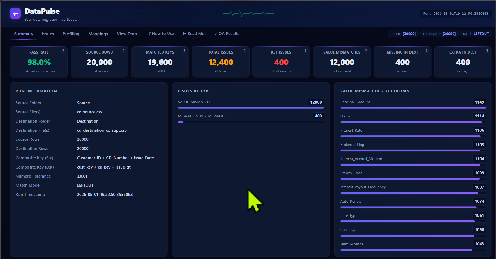
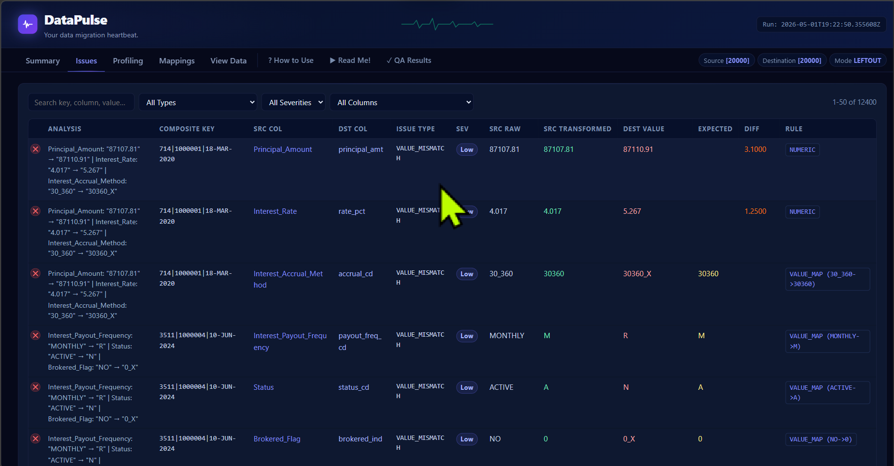
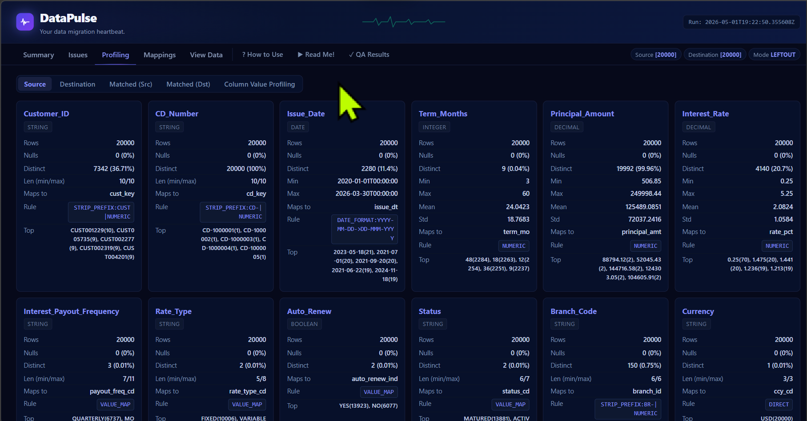
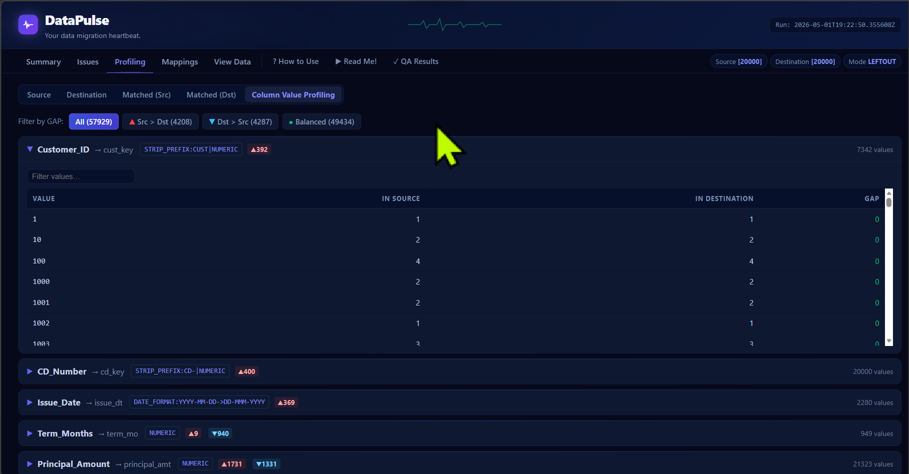
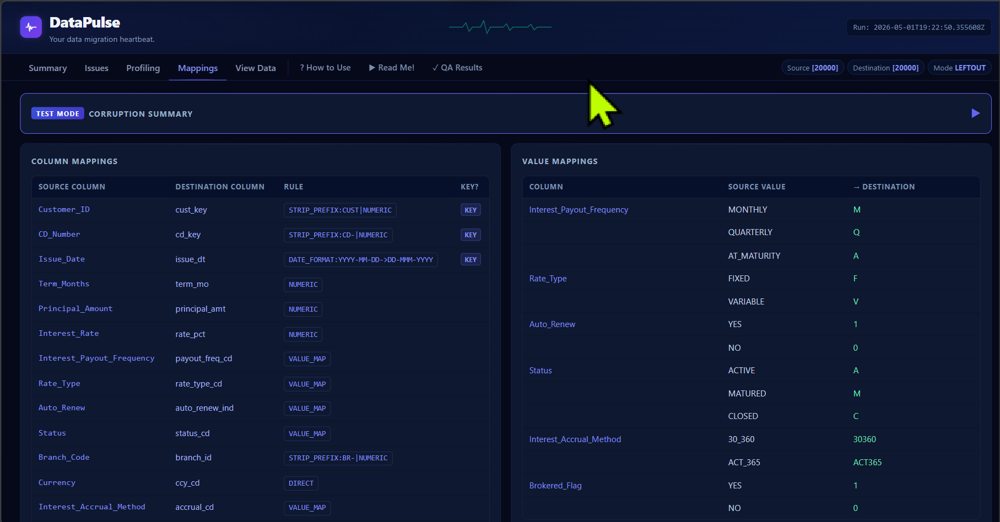
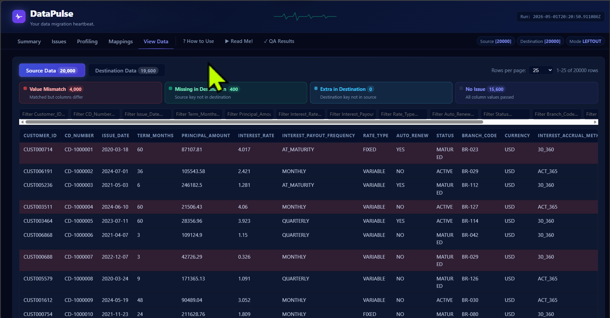

# DataPulse — Data Migration Validation Engine

> **Stop guessing. Know exactly what changed, what broke, and what passed — before your migration goes live.**

DataPulse is a zero-dependency Python engine that compares any source and destination dataset, applies your transformation rules, and renders a fully interactive HTML dashboard. No server. No BI tool. No waiting. Just open the file in a browser and your entire migration health is right there.

---

## Why Teams Use DataPulse?

Data migrations fail silently. Records go missing. Codes get mapped wrong. Dates arrive in the wrong format. By the time someone notices, the damage is already downstream. DataPulse was built to catch all of that — automatically, before it reaches production.

- **Visual, not just numbers** — An interactive dashboard that lets anyone on the team (not just engineers) understand what passed, what failed, and why
- **Schema-agnostic** — Two mapping files drive everything. Swap datasets without touching the engine
- **Honest about transformations** — Strips prefixes, converts dates, maps codes — and shows you exactly what the transformed value looked like vs. what was expected
- **Runs anywhere** — Pure Python standard library. No pip, no Docker, no setup

---

## The Dashboard at a Glance



*Summary tab — 20,000 records validated in seconds. KPIs, issue breakdown, and value mismatch heatmap by column — all in one view.*

---

## What You Can Do With It?

| Capability | Description |
|---|---|
| **Composite Key Matching** | Match records across systems with multi-column keys — even when formats differ |
| **Smart Transformation** | Strip prefixes, convert dates, map codes, handle numeric tolerance |
| **Issue Classification** | 10 distinct issue types from missing keys to null mismatches — each with severity |
| **Column Profiling** | Source vs. destination statistics per column — nulls, distinct counts, min/max, top values |
| **Value Count Comparison** | Side-by-side value distribution after transformation — spot gaps instantly |
| **Row-Level Audit Trail** | `row_match_summary.csv` tracks every source record with PASS/FAIL per column |
| **TEST MODE** | Load a corruption summary file directly into the dashboard for QA sign-off |
| **Match Modes** | Full outer join, source-primary, destination-primary, or inner join — your choice |

---

## Quick Start — 3 Steps

**1. Configure your paths** (edit the top of `check_datapulse.py`):

```python
folder_path  = "My_Dataset"
SOURCE_FOLDER = folder_path + "/Source"
DEST_FOLDER   = folder_path + "/Destination"
COLMAP_PATH   = folder_path + "/Mapping_Rule/column_mapping.csv"
VALMAP_PATH   = folder_path + "/Mapping_Rule/value_mapping.csv"
OUTPUT_DIR    = "output"
MATCH_MODE    = "leftout"   # full | leftout | rightout | union
RUN_MODE      = "PROD"      # TEST shows corruption summary on Mappings tab
```

**2. Run:**

```bash
python check_datapulse.py
```

**3. Open the dashboard:**

```
output/dashboard.html
```

That's it. No server, no install, no configuration files beyond your two mapping CSVs.

---

## Transformation Rules

The engine understands these rule codes in `column_mapping.csv`:

| Rule | Example | What It Does |
|---|---|---|
| `DIRECT` | `DIRECT` | Trim + case-insensitive compare |
| `NUMERIC` | `NUMERIC` | Float compare within tolerance (default ±0.01) |
| `DECIMAL` | `DECIMAL` | Exact match ignoring trailing zeros |
| `VALUE_MAP` | `VALUE_MAP` | Translate via value_mapping.csv lookup table |
| `STRIP_PREFIX:<p>` | `STRIP_PREFIX:CUST` | Remove leading prefix before compare |
| `DATE_FORMAT:<src>-><dst>` | `DATE_FORMAT:YYYY-MM-DD->DD-MMM-YYYY` | Convert date format |

Rules chain with `\|` — e.g. `STRIP_PREFIX:CD-\|NUMERIC` strips the prefix then compares as a number.

---

## Issues Tab — Every Problem Has Context



*Every issue shows the composite key, source and destination values, the transformation that was applied, and what was expected. No more digging through raw CSVs.*

---

## Column Profiling — Know Your Data



*Per-column statistics across source, destination, and matched subsets. Type inference, null rates, distinct counts, and top values — all without writing a single query.*

---

## Value-Level Comparison — Spot the Gaps



*Column Value Profiling shows every unique value side-by-side after transformations are applied. GAP indicators flag values that exist in one side but not the other.*

---

## Mappings Tab — Full Transparency



*Column mappings and value mapping rules displayed in full. In TEST MODE, a collapsible corruption summary appears at the top so QA teams can validate the test dataset against the results.*

---

## View Data — Browse and Filter



*Browse mode-filtered source or destination data with row-level colour coding. Legend cards show live counts — value mismatches, missing keys, and clean rows — and clicking any card filters the table instantly.*

---

## Scalability Roadmap

DataPulse today runs on CSV files. The architecture is already designed to scale to enterprise data platforms — the validation engine is completely decoupled from the data loading layer.

### Next Level: Cloud Data Platforms

| Platform | Integration Path | What Changes |
|---|---|---|
| **Databricks** | `databricks-connect` or `pyspark` | Replace `_load_folder_csv()` with a Delta table reader — Unity Catalog tables become the source/destination |
| **Snowflake** | `snowflake-connector-python` | Query Snowflake tables directly, stream rows into the same validation pipeline |
| **Microsoft Fabric** | `semantic-link` / `notebookutils` | Run natively inside a Fabric Notebook — read from Lakehouses or Warehouses, write results back as Delta tables |
| **Azure Data Factory** | REST trigger or Python activity | Embed DataPulse as a validation step inside ADF pipelines — post-migration gate |
| **dbt Integration** | Post-hook or test extension | Run DataPulse as a dbt test against model outputs |

**What stays the same:** The mapping files, the validation logic, the issue classification, the dashboard — all identical regardless of where the data comes from.

**What scales up:** Data volume (millions of rows via Spark), scheduling (triggered by pipeline completion), centralised results (written back to Delta/Snowflake tables), and team access (dashboard served from a storage account or embedded in a portal).

> If your team is on Databricks, Snowflake, or MS Fabric and you want DataPulse running as part of your migration pipeline — the foundation is already here.

---

## Folder Structure

```
DataValidation/
├── check_datapulse.py              # Engine + dashboard (single file, zero dependencies)
├── Data_Folder_Template/
│   ├── Source/                     # Drop source CSV file(s) here
│   ├── Destination/                # Drop destination CSV file(s) here
│   └── Mapping_Rule/
│       ├── column_mapping.csv      # Column map + transformation rules
│       └── value_mapping.csv       # Code translation / date format specs
└── output/                         # Generated on every run
    ├── dashboard.html              # Self-contained interactive dashboard
    ├── datapulse_results.json      # Summary + full issue detail
    ├── datapulse_results.csv       # Issues only, flat CSV
    ├── row_match_summary.csv       # Every source row — PASS/FAIL per column
    ├── profiling.json              # Column statistics
    └── mappings.json               # Normalised mapping rules
```

---

## Output Files

| File | Who Uses It |
|---|---|
| `dashboard.html` | Everyone — analysts, engineers, PMs, stakeholders |
| `datapulse_results.csv` | Data teams doing further analysis |
| `row_match_summary.csv` | Auditors and QA teams needing a full audit trail |
| `profiling.json` | Engineers building downstream automation |

---

## Requirements

- Python 3.8 or later
- Standard library only — `csv`, `json`, `os`, `statistics`
- No pip. No virtual environment. No dependencies.

---

## See the Full Showcase

For a slide-by-slide walkthrough of every dashboard feature, see **[SHOWCASE.md](SHOWCASE.md)**.

---

*DataPulse — built for teams who care about data quality and need to prove it.*
