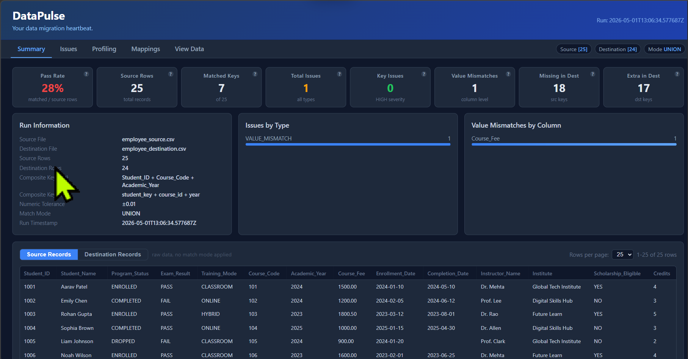
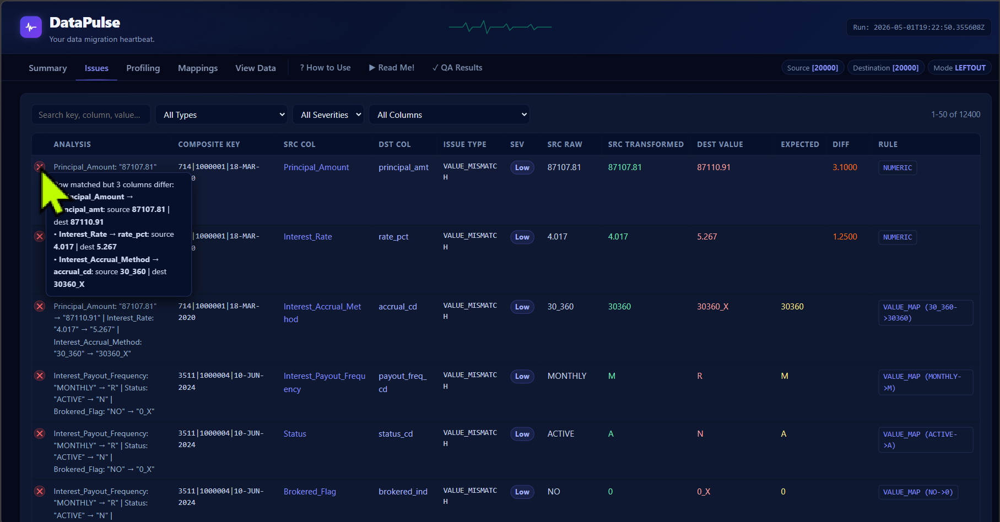
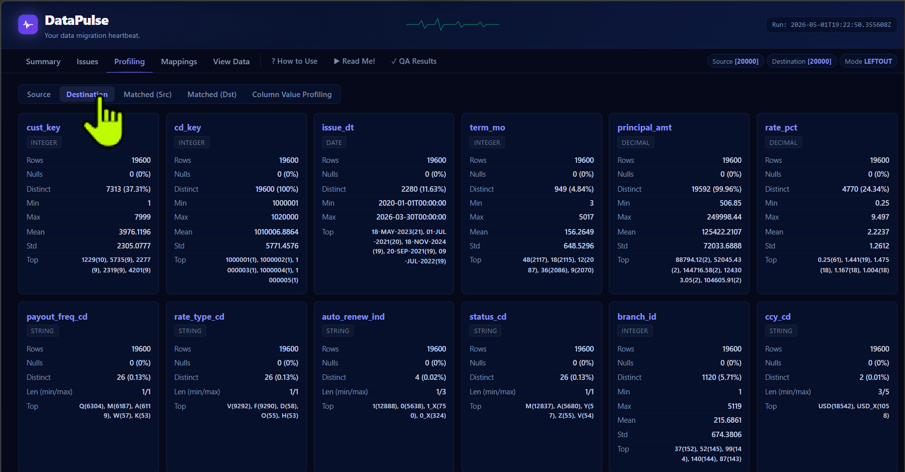
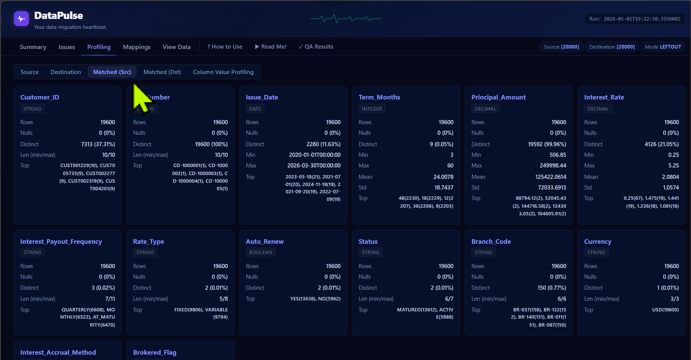
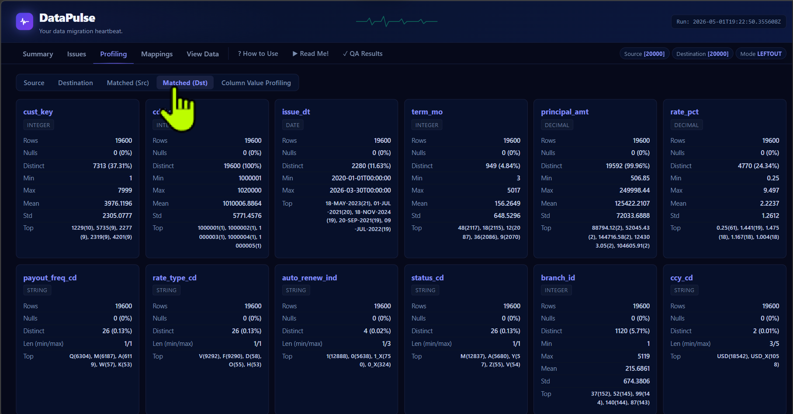
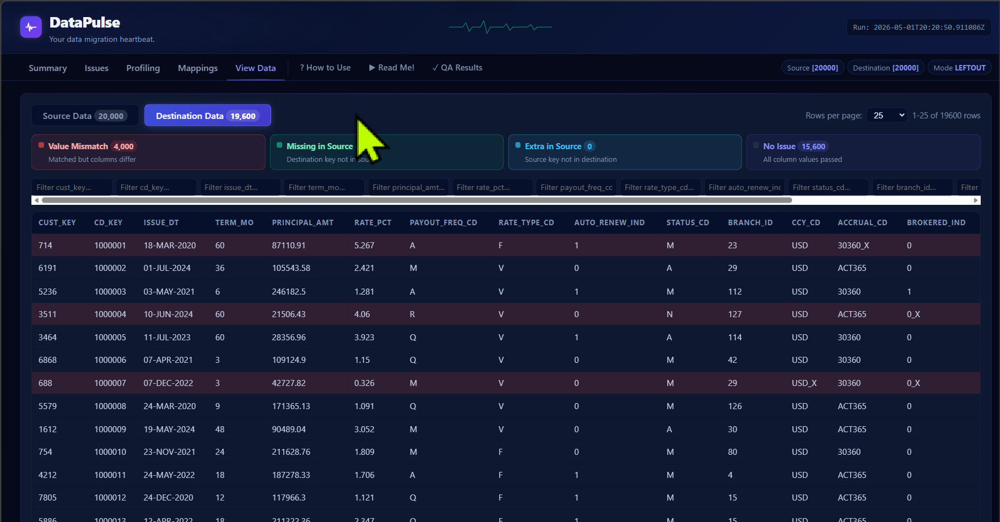

# DataPulse — Feature Showcase

> A guided walkthrough of every feature in the DataPulse dashboard. Use this to walk clients, leads, or team members through what DataPulse does and how it works in practice.

---

## Slide 1 — Where It All Starts: The Summary Dashboard (Early View)

**What you're looking at:**
The DataPulse Summary tab during an early validation run against a small student dataset (25 records). Even at this scale the value is immediate — pass rate, matched key count, issue counts, and a live breakdown of issues by type and by column are all visible the moment you open the dashboard.

**Key things to notice:**
- The **8 KPI cards** across the top give you the headline numbers at a glance
- The **Run Information** panel on the left shows exactly which files were compared, which columns form the composite key, and the match mode applied
- The **Source Records** table at the bottom lets you browse raw data without leaving the dashboard
- Zero external tools required — this is a single `.html` file

---

## Slide 2 — Production Scale: 20,000 Records Validated

**What you're looking at:**
The same Summary tab running against a 20,000-row Certificate of Deposit dataset. This is what your stakeholders see after a real migration run — clear, immediate, no ambiguity.

**Key things to notice:**
- **98% pass rate** — 19,600 records matched and validated
- **12,400 issues** identified across the dataset, broken down by type in the bar chart
- **400 Migration Key Mismatches** — partial composite key matches flagged separately from hard misses
- The **Value Mismatches by Column** chart on the right instantly shows which columns have the most problems — `Principal_Amount` leads, meaning a transformation rule may need tuning
- Tab bar always shows **Source [20000] · Destination [20000] · Mode LEFTOUT** — no ambiguity about what was compared

---

## Slide 3 — Issues Tab: Every Problem Has a Name

**What you're looking at:**
The Issues tab — a filterable, sortable table of every problem found in the migration. Each row represents one issue with full context.

**Key things to notice:**
- **Composite key** shown for each issue so you can find the exact record in your system
- **Source value**, **transformed value**, **destination value**, and **expected value** — all visible in a single row. No cross-referencing needed
- **Rule applied** column shows which transformation was active — immediately tells you whether the issue is a data problem or a mapping problem
- **Severity badges** (HIGH / MEDIUM / LOW) help triage — fix the High issues before you investigate Low ones
- Filter by issue type, column, or keyword — the table responds instantly

---

## Slide 4 — Issues Tab: Drill Into Any Row

**What you're looking at:**
The Issues tab with a row expanded — the hover tooltip on the row icon shows the full mismatch detail for that specific record.

**Key things to notice:**
- The **info / error / warning icons** (ℹ ✕ ⚠) on the left of each row give instant visual severity
- Hovering an icon pops a tooltip with the complete diagnostic — source key parts, transformed value, destination actual value, and the exact rule that was applied
- **Migration Key Mismatch rows** show colour-coded key parts: green = matched key component, red = unmatched component — so you see immediately which part of the composite key diverged
- This level of detail means your analysts can diagnose root cause without going back to the raw data

---

## Slide 5 — Profiling Tab: Know Your Source Data

**What you're looking at:**
The Profiling tab, Source sub-tab — per-column statistics for all 14 source columns across 20,000 rows.

**Key things to notice:**
- **Type inference** — DataPulse automatically classifies each column as integer, float, date, or string
- **Null rate, distinct count, min, max** — the basics that tell you immediately whether a column looks healthy
- **Top values** — at a glance you can see whether a code column has unexpected entries
- This data is computed from the mode-filtered rows — so the statistics always match what the dashboard actually compared
- Sub-tabs: **Source / Destination / Matched (Src) / Matched (Dst)** — compare profiles across all four perspectives

---

## Slide 6 — Profiling Tab: Destination Column Statistics

**What you're looking at:**
The Profiling tab, Destination sub-tab — same column-level statistics but for the destination dataset after the migration.

**Key things to notice:**
- Destination columns use their destination names (e.g. `cust_key`, `cd_key`, `issue_dt`) while source profiling uses source names
- Comparing source vs. destination profiles side-by-side reveals format differences — `issue_dt` in destination is `DD-MMM-YYYY`, `Issue_Date` in source is `YYYY-MM-DD`
- **Distinct counts** between source and destination can reveal dropped or duplicated values that slipped through the transformation
- The profiling sub-tab toggle makes switching between all four views a single click

---

## Slide 7 — Profiling Tab: Matched Destination Subset

**What you're looking at:**
The Profiling tab, Matched (Dst) sub-tab — statistics computed only on destination rows that found an exact composite key match in the source.

**Key things to notice:**
- Profiling the **matched subset** isolates what the transformation engine actually processed — you're not polluting the statistics with records that never matched
- Row count drops from 20,000 to 19,600 (the matched set) — confirming that 400 records in each side had key discrepancies
- Comparing Matched (Src) vs. Matched (Dst) profiles on the same column reveals whether the transformation is working as expected — if `issue_dt` distinct counts match `Issue_Date`, date conversion is healthy
- This is the profiling level that matters for QA sign-off

---

## Slide 8 — Profiling Tab: Matched Destination (Deep View)

**What you're looking at:**
A deeper look at the Matched (Dst) profiling tab, scrolled to show lower columns including `payout_freq_cd`, `rate_type_cd`, `auto_renew_ind`, and `status_cd`.

**Key things to notice:**
- Code columns like `payout_freq_cd` (M/Q/A) and `status_cd` (A/M/C) show their distinct values and distribution
- Any unexpected code appearing in the destination that wasn't in the source value mapping would show up here as an unfamiliar top value
- Binary indicator columns like `auto_renew_ind` and `brokered_ind` should show only 2 distinct values — a count higher than 2 is an immediate red flag
- The profiling tab is the fastest way to validate that your value mapping table is complete and correct

---

## Slide 9 — Column Value Profiling: Side-by-Side After Transformation

**What you're looking at:**
The Column Value Profiling sub-tab — a unique feature that shows every distinct value for each column, side-by-side in source and destination, **after transformations are applied**.

**Key things to notice:**
- The **GAP column** highlights where counts differ between source and destination — a non-zero gap means that value appears a different number of times on each side
- **Filter buttons** — All / Src > Dst / Dst > Src / Balanced — let you focus immediately on the discrepancies
- `Customer_ID → cust_key` shows **392 gaps** — 392 customer IDs appear with different frequencies across the two datasets
- The transformation rule badge (`STRIP_PREFIX:CUST|NUMERIC`) is shown next to each column name — so you know exactly which rule was active when these counts were computed
- This is the most powerful feature for answering "are the right records present in the right quantities?"

---

## Slide 10 — Mappings Tab: Full Rule Transparency

**What you're looking at:**
The Mappings tab — a complete reference of all column mapping rules and value translation tables loaded for this run.

**Key things to notice:**
- **Column Mappings** table shows every source-to-destination column pair, its transformation rule, and whether it is part of the composite key
- **Value Mappings** table shows every code translation — `MONTHLY → M`, `ACTIVE → A`, `YES → 1` — so anyone can verify the lookup table without opening a CSV
- The **TEST MODE** badge at the top (collapsed) is the collapsible Corruption Summary — in a QA environment this card expands to show exactly what corruptions were injected into the test dataset, so the QA team can verify that DataPulse caught every one
- The Mappings tab is the single source of truth that a business analyst, data engineer, and QA tester can all look at together during a review

---

## Slide 11 — View Data: Source with Live Legend Counts

**What you're looking at:**
The View Data tab showing source data — 20,000 rows with row-level colour coding and legend cards that show live counts for each status category.

**Key things to notice:**
- **Source Data [19,600]** — the count badge on the button shows the mode-filtered row count, not the raw total
- Legend cards: **Value Mismatch [5,000] · Missing in Destination [400] · Extra in Destination [0] · No Issue [15,200]** — click any card to filter the table to only that category
- **Red rows** = records with at least one value mismatch. **Green rows** = source keys with no destination match. **Uncoloured rows** = clean
- Per-column filter inputs let you narrow to a specific customer, date range, or value — across all 20,000 rows
- Table height adjusts to the rows-per-page setting with no vertical scrollbar — the card itself scrolls naturally

---

## Slide 12 — View Data: Destination Perspective

**What you're looking at:**
The same View Data tab switched to the Destination view — now showing destination records with the legend relabelled to reflect the destination perspective.

**Key things to notice:**
- **Destination Data [20,000]** — the destination has all 20,000 rows (no hidden rows in leftout mode for the destination side)
- Legend labels have **automatically flipped**: "Missing in Destination" is now **"Missing in Source"** and "Extra in Destination" is now **"Extra in Source"** — the language always matches the current perspective
- **Sky-blue rows** now represent destination records whose key was not found in the source — the colour meaning is consistent, the label shifts to match
- The destination columns (`cust_key`, `cd_key`, `issue_dt`, `principal_amt`, etc.) are shown in their native format — the dashboard never overwrites the raw data
- Composite key columns always appear **first** in the table, regardless of their original column order

---

## Summary: What DataPulse Gives You

| Before DataPulse | With DataPulse |
|---|---|
| Manual SQL comparisons, hours per migration | Automated validation in seconds |
| "It looks about right" | Exact pass rate, issue count, column-level breakdown |
| Engineers digging through CSVs to find mismatches | Anyone on the team can read the dashboard |
| Discovering data problems after go-live | Catching everything before UAT |
| One-off scripts that break on the next project | Schema-agnostic engine that works on any dataset |

---

## Ready to Scale?

DataPulse on CSVs is just the beginning. The validation engine is fully decoupled from the data loading layer — connecting to **Databricks**, **Snowflake**, or **Microsoft Fabric** is a matter of swapping the data reader, not rewriting the logic. Results can be written back to Delta tables, served from a storage account, or embedded in a data portal.

For enterprise integration enquiries or a live demo, see the [README](README.md) for the full scalability roadmap.

---

*All screenshots taken from a live run against a 20,000-row Certificate of Deposit dataset with intentional data corruptions injected for demonstration purposes.*
